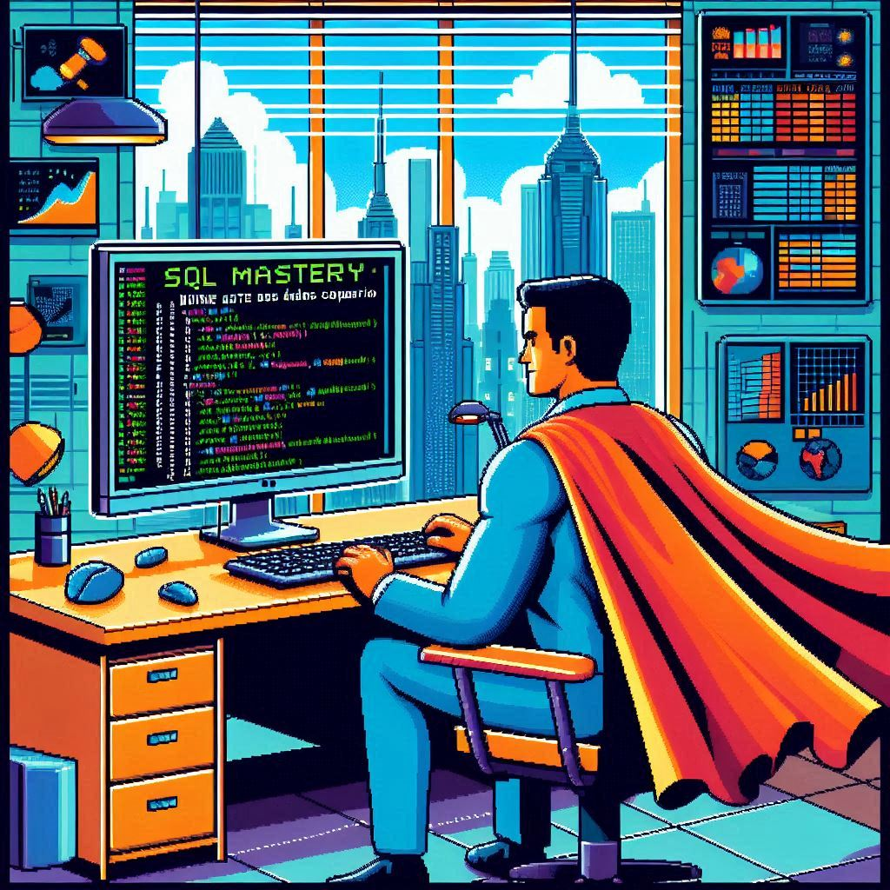

    

-------

# Projeto EBOOK Gerado por I.A.s

 > ℹ️ **NOTE:** Este é o repositório desenvolvido durante o bootcamp Santander 2024 - Fundamentos de IA para Devs na plataforma da [DIO](https://dio.me)

Projeto com o objetivo de gerar um ebook digital com as facilidades das ferramentas de IA. todos os prompts
seguem abaixo.

Para seguir os exemplos deste eBook, você pode usar o script de exemplo [exampleDB.sql](https://github.com/Jcnok/Santander_2024-Fundamentos_de_IA_para_Devs/blob/main/Criando%20um%20Ebook%20com%20ChatGPT%20%26%20MidJourney/data/exampleDB.sql) para criar o banco de dados.​

<a href="https://github.com/Jcnok/Santander_2024-Fundamentos_de_IA_para_Devs/blob/main/Criando%20um%20Ebook%20com%20ChatGPT%20%26%20MidJourney/output/ebook%20-%20SQL%20Mastery.pdf" title="View PDF now"> 📕Clique aqui para ler</a>

## 💻 Tecnologias utilizadas no projeto

- [ChatGPT](https://chat.openai.com/) 
- [Copilot Designer](https://copilot.microsoft.com/)
- [PowerPoint](https://www.microsoft.com/en/microsoft-365/powerpoint)

## 🧠 Prompts

ChatGPT：

|   Ação   | prompt                                                                                                                                                                                                                                                                         |
| :------: | ------------------------------------------------------------------------------------------------------------------------------------------------------------------------------------------------------------------------------------------------------------------------------ |
|  título  | crie um título de um ebook sobre o tema de SQL, o ebook é do nicho de programação e o subnicho é de SQL, o titulo deve ser épico e curto, e tenha uma temática mais nerd e business, pois quero atacar exatamente a área cooporativa, me liste 5 variações de títulos.                                                        |
| conteúdo | Faça um texto para ebook, com foto em SQL, listando os principais comandos com exemplos de código:
* {REGRAS}
  * >Explique sempre de uma forma simples
  * >Deixe o texto enxuto
  * >Sempre traga exemplos de código em contextos reais do mundo corporativo
  * >Sempre deixe um título sugestivo por tópico

Copilot Designer：

|  Ação  | prompt                                                                                 |
| :----: | -------------------------------------------------------------------------------------- |
| título | Pixel art illustration of a corporate office with a heroic figure at a computer, surrounded by data streams and databases. The hero is wearing a business suit with a pixelated cape, typing on a keyboard with SQL code visible on the monitor. Background includes office elements like desks, charts, and graphs, with a futuristic cityscape visible through the windows. Bright, vibrant colors with a retro video game feel. The text 'SQL Mastery: Domine a Arte dos Dados Corporativos' in a pixelated font at the top. --v 5 --q 2 --style 80s --ar 16:9 |

## ✨ Features

- Conteúdo gerado via ChatGPT
- Imagens geradas via Copilot Designer

## 📚 Materiais

- Imagens utilizadas em `assets`
- ebook gerado durante as aulas em `output`

## 👨‍💻 Expert

    
    
&nbsp&nbsp&nbspJulio Okuda 
    &nbsp&nbsp&nbsp
    <a href="https://github.com/Jcnok">
    GitHub</a>&nbsp;|&nbsp;
    <a href="https://linkedin.com/in/juliookuda">LinkedIn</a>
&nbsp;|&nbsp;
    

  

